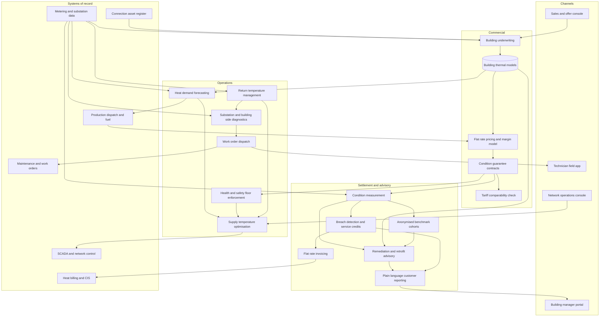

# Warmpact

**Source:** `ai-in-energy/deloitte-mpact_of_digitalization_in_district_heating_summary_ENG/`
**Domain:** `ai-energy`
**One-liner:** A condition-as-a-service platform that lets a district heating company sell a guaranteed indoor-condition subscription at a flat monthly rate instead of metered megawatt-hours, and gives it the underwriting, forecasting, substation diagnostics, and return-temperature control needed to keep that guarantee profitable while heat demand falls.
**Wedge:** Municipal and regional heating companies with 2,000–30,000 building connections in Nordic and Baltic networks, starting with the housing-company and public-property segments where a building manager already stands between the utility and the occupant, and where remote-read substation data already exists but is used only for billing.
**Positioning:** The revenue-model layer for district heating, not another monitoring dashboard. The source is explicit that individual digital services such as usage monitoring do not provide significant added value to the customer; what customers will pay for is the operating condition itself. Warmpact turns that into a sellable, underwritable, settleable product — and decouples the heating company's revenue from a volume that is structurally shrinking.

## Market research synthesis

### Thesis from source

The source is a Deloitte Finland study summary from December 2016 on the impact of digitalization in district heating, built on customer interviews, sector and expert interviews, public sources, and Deloitte analysis. It opens with a customer interview exchange that functions as the whole strategic indictment: a major actor in real estate describes introducing a five-year energy project that achieved a six-year payback period, is asked what role heating companies played in the project, and answers "None whatsoever" — because, in the customer's words, it did not even cross their minds that the heating company would have the knowledge or interest to help them save energy. The incumbent supplier was absent from the largest energy decision its own customer made.

The study's structural argument is that demand for heating energy is continually reduced by improved building energy efficiency and better access to alternative heating methods, and that district heating companies must decide on their role as this happens. It notes that the major wave of modernization, which will shake the basic structures and business models, is yet to come. It rates utilities near the bottom of a cross-sector digital maturity comparison: very few steps taken towards extensive digital business, some smart meters installed but the utilization of the data and customer relations still narrow, with focus on internal operations. It then lists the incumbent qualities that become liabilities — good resources, market leadership, decades-long planning periods, good controlled profits, natural monopoly, internal rigidity, slow innovation — and concludes that although high switching costs have prevented a rapid loss of customers, the stagnation of district heating companies will create a vacuum asking to be filled by digital disrupting startups. A district heating company quoted in the expert interviews puts the strategic choice plainly: there is no doubt that new services are on their way in, we need to cannibalize our own business by offering energy saving services, and if we don't do it, somebody else will.

The customer research is where the product design actually comes from, because it is unusually blunt about what not to build. The key finding from the interviews is that customers want a professional partner who can offer easily accessible overall solutions, and that individual digital services, such as usage monitoring, are interesting but do not provide significant added value to the customer. The segment tables then split needs into what customers care about and what they refuse to be involved in. They are interested in securing reliability — prepared to pay to minimize risks to their business operations — securing health and safety, approaching business-critical operating conditions as a whole with heating just one factor among many, open communication and true partnership, professional consultation on the status of properties based on benchmarking against comparable facilities, transparent overall solutions presented in concrete plain language, overall economy meaning the effect of chosen services on long-run annual user expenditure, flexible solutions because they are concerned about vendor lock-in and want to reserve the right to reorganize their heating services differently in future, and overall responsibility for the implementation and optimization of heating services. They explicitly do not wish to be involved in manual adjustments and optimization, in discussions about heating method rather than what services can do for them, in raw consumption data — the study repeats three times that customers are interested in final conclusions — in decision-making and competitive tendering without the necessary knowledge about the field, or in provider-dictated pricing.

The study then maps nine development paths across a grid from limited development to full transformation and from core and support efficiency to customer experience and service offering. Path 4, superior efficiency, combines data sourced from the network, production, usage, and weather conditions to achieve superior efficiency and predictable property management and maintenance. Path 6, energy efficiency consultation, uses consumption data for consultation on energy saving through system optimization and structural repairs. Path 8 is the commercially decisive one and reads as a direct instruction: selling facility conditions — sell to customers what they care about the most, the operating condition, and an operating condition may be priced with a flat monthly rate. Path 3 is district heating offered as a turnkey service by expanding into maintenance and servicing. The value-chain analysis supplies the operational preconditions that make path 8 safe to sell rather than reckless: modelling and analytics in network design, investments and contracting; remote control and monitoring of the network and substations; predictive servicing and maintenance through sensors and analytics; and the optimal management of network load including local heating supplies. Warmpact is the system that implements path 8 with paths 4 and 6 underneath it — because a guaranteed indoor condition at a flat rate is an insurance product, and selling it without building-level thermal underwriting, substation fault detection, and return-temperature discipline converts a margin problem into a claims problem.

### Buyer & economic model

- **Primary buyer:** the CEO or Head of Business Development at a municipal or regional district heating company, co-sponsored by the CFO who owns the volume-decoupling problem and by the Head of Network Operations who has to deliver the guarantee.
- **Users:** heat sales and account managers (daily, selling and renewing condition contracts), service and underwriting analysts (per building assessment), network operations and load planners (daily supply temperature and load decisions), substation service technicians (work orders in the field), energy advisors and consultants (remediation and retrofit proposals), billing and revenue assurance (flat-rate invoicing and service credits), regulatory and tariff staff (coexistence with the regulated heat tariff), and the customer-side building manager as an external user.
- **Budget owner / value metric:** heat sales revenue and service margin. The value metric is gross margin per connection per year decoupled from delivered megawatt-hours, plus average return temperature reduction across the network, which is the operational lever that converts a customer-facing promise into distribution efficiency. Secondary metrics are churn to alternative heating methods, service revenue as a share of total revenue, and the share of connections under a condition contract.
- **Competing status quo:** metered heat sold under a regulated or published tariff, a customer portal showing consumption graphs nobody reads, reactive substation service triggered by a complaint about lukewarm radiators, and an annual price letter. Meanwhile the roles the source warns about are already competing for the customer relationship: energy efficiency consultants, providers of alternative heating methods such as ground-source heat pumps, and larger building management companies developing their own technical service expertise. The customer's own building manager is the incumbent's real competitor for the advisory position.

### Domain constraints

- **Regulatory / trust / safety:** district heating pricing is publicly scrutinised and in several jurisdictions subject to reasonableness or non-discrimination requirements, so a flat-rate condition product must coexist with the published heat tariff and be demonstrably non-discriminatory between comparable customers rather than an opaque bilateral deal. Guaranteeing an indoor condition creates health and safety exposure — minimum indoor temperature obligations, legionella risk if domestic hot water temperature is optimised downward, and tenant rights in housing companies — so the guarantee must have explicit floors that optimisation cannot cross. Taking overall responsibility for heating services means taking on building-side equipment the utility does not own, which requires clear liability allocation and access rights. Carbon intensity and fuel mix are increasingly reported and in some markets priced, so the guarantee's cost model must carry a carbon term rather than treating fuel as a pass-through afterthought.
- **Data sensitivity:** substation and building-level heat data reveals occupancy and use patterns for the building and, in single-family connections, for a household, so it is personal data at the dwelling level and must be handled accordingly. Benchmarking a property against comparable properties — which the source says customers explicitly want — requires disclosing comparative performance without exposing another customer's identifiable consumption, so cohorts need minimum size and anonymity thresholds. Building condition findings are commercially sensitive to the owner because they affect asset value and future capital plans, and a remediation proposal is effectively a diagnosis of the owner's asset.
- **Change-management realities:** the source names the exact internal obstacles — decades-long planning periods, internal rigidity, slow innovation, and good controlled profits that remove the urgency to change — so the platform has to make a condition contract sellable by an existing heat sales team rather than requiring a new commercial organisation. Customers refuse manual adjustment and optimisation work, which means any capability that depends on the building manager doing something will not be used. Customers are concerned about vendor lock-in and want to reserve the right to reorganize their heating services in future, so an exit and transfer package is a feature rather than a concession. And the study's own warning applies to the pricing model: customers reject provider-dictated pricing and want influence over the user costs of heating services, so the flat rate has to be transparently constructed and revisable on stated terms.

## Business requirements

- BR-1: The company must be able to sell a guaranteed operating condition — indoor temperature band, domestic hot water availability, and response time — at a flat monthly rate, with the guarantee and its exclusions stated in plain language rather than in metering terms.
- BR-2: No condition contract may be offered on a building until that building has been underwritten for thermal behaviour, substation health, and envelope condition, and the underwriting result must set the price rather than the price setting the assumptions.
- BR-3: Gross margin per connection must be measurable independently of delivered megawatt-hours, so that the company can demonstrate revenue decoupling as heat demand continues to fall.
- BR-4: Guarantee performance must be settled against measured conditions each period, with service credits applied automatically when the guarantee is breached, and the customer must not have to detect a breach in order to be credited.
- BR-5: Optimisation must never cross health and safety floors — minimum indoor temperature and domestic hot water temperature for legionella control — and these floors must be non-negotiable regardless of the margin consequence.
- BR-6: Customer reporting must deliver conclusions and recommended actions in plain language, and must not require the customer to interpret raw consumption data or perform manual adjustment, because the research finds customers explicitly refuse both.
- BR-7: Every property must be benchmarkable against comparable properties for condition and efficiency, without exposing any other customer's identifiable consumption.
- BR-8: Remediation and retrofit proposals must state the effect on the customer's long-run annual expenditure, not only the energy saving, and must be issued even when they reduce the company's heat sales volume.
- BR-9: Every condition contract must include a stated exit and transfer package that returns the building's model, condition history, and settings to the customer, because the research finds customers require the right to reorganise their heating services later.
- BR-10: Flat-rate pricing must be transparently constructed from named components with defined revision triggers, and comparable customers must be priced on comparable terms so the product can withstand tariff scrutiny.
- BR-11: Return temperature performance must be measured and improved at the connection level, and the commercial model must reward the company for reducing it, since distribution efficiency is where the volume-decoupled margin is actually earned.
- BR-12: The fuel mix and carbon intensity behind delivered heat must be reported to the customer and carried in the cost model of every guarantee, so that a condition product remains defensible as carbon costs rise.

## User stories

Canonical user stories live in sibling [USER_STORIES.md](USER_STORIES.md).

## System design

### Overview

Warmpact wraps a district heating company's existing network and metering estate in a commercial and operational layer for selling operating conditions. A building enters through underwriting: substation telemetry, historic heat and flow data, weather series, and a physical survey produce a building thermal model, a substation health assessment, and an envelope condition estimate, which together determine whether a guarantee can be offered and at what flat rate. Accepted buildings receive a condition contract defining the guaranteed indoor temperature band, domestic hot water availability, response time, exclusions, revision triggers, and exit terms. In operation, demand forecasting drives network load planning and supply temperature setpoints, bounded by hard health and safety floors that no optimisation may cross. Substation diagnostics run continuously against the same telemetry, raising fault findings — high return temperature, undersized or fouled heat exchanger, faulty control valve, bypass flow — as work orders with evidence attached. Measured conditions are compared to the guarantee each period; breaches produce automatic service credits on the flat-rate invoice. Where the building itself is the constraint, the advisory capability issues a remediation or retrofit proposal stating the effect on the customer's long-run annual expenditure, benchmarked against an anonymised cohort of comparable properties, even when the proposal reduces heat sales volume. Customer-facing output is conclusions and actions, never raw data. Margin is reported per connection independently of delivered megawatt-hours, with return temperature performance and carbon intensity carried alongside.

### Actors & boundaries

- **Actors:** heat sales and account manager, service and underwriting analyst, network operations and load planner, substation service technician, energy advisor, billing and revenue assurance analyst, tariff and regulatory officer, governance administrator, and the customer-side building manager or property owner as an external user.
- **Trust boundary:** the health and safety floors sit outside commercial control — minimum indoor temperature and domestic hot water temperature are enforced by the setpoint service and cannot be relaxed by a pricing or margin decision. Building-level and dwelling-level consumption data stays inside the utility's boundary; what reaches a benchmarking view is an anonymised cohort statistic subject to minimum cohort size. Building condition findings and remediation proposals are the property owner's commercially sensitive information and are not exposed to other customers or used to price a competitor's building. On exit, the building's model, condition history, and settings leave with the customer rather than remaining as a lock-in asset.
- **Human-in-the-loop points:** underwriting decision and any decline; guarantee pricing approval and price revision; safety-floor override attempts, which are refused and logged rather than escalated; fault finding triage before dispatch; remediation proposal approval before issue; service credit exceptions above a threshold; exit package release; tariff comparability review.

### Core capabilities

1. **Condition product design** — definition of guarantee templates covering indoor temperature band, domestic hot water availability, response time, exclusions, revision triggers, and exit terms in plain language.
2. **Building underwriting** — construction of a building thermal model from substation telemetry, heat and flow history, and weather series, combined with substation health and envelope condition, producing a decision to offer, decline, or offer remediation first.
3. **Flat-rate pricing and margin modelling** — degree-day normalised, volume-decoupled pricing built from named components including fuel and carbon, with comparability checks across similar customers.
4. **Heat demand forecasting** — building-level and network-level load forecasting against weather, occupancy, and building stock, supporting production dispatch and fuel procurement.
5. **Supply temperature optimisation** — network setpoint optimisation to reduce distribution heat loss, constrained by the binding connection and hard-stopped at the health and safety floors.
6. **Return temperature management** — connection-level return temperature measurement, ranking by cost to the network, and improvement tracking.
7. **Substation and building-side diagnostics** — continuous fault detection for high return temperature, heat exchanger fouling or undersizing, control valve failure, and bypass flow, with evidence-bearing work orders.
8. **Guarantee measurement and settlement** — comparison of measured conditions to the guarantee, breach detection without customer reporting, and automatic service credits.
9. **Remediation and retrofit advisory** — proposals stating effect on long-run annual expenditure, benchmarked against anonymised comparable-property cohorts, issued regardless of volume impact.
10. **Plain-language customer reporting** — conclusions, recommended actions, and condition status; explicitly not raw consumption data or manual adjustment tasks.
11. **Flat-rate billing and revenue assurance** — invoice generation with credits, and margin per connection reported independently of delivered volume.
12. **Fuel mix and carbon reporting** — carbon intensity behind delivered heat carried in the guarantee cost model and disclosed to the customer.
13. **Exit and portability** — release of the building model, condition history, and settings on contract exit or transfer.
14. **Tariff coexistence and governance** — comparability evidence against the published heat tariff, and an audit trail of guarantee, price, and override events.

### Conceptual data

- **Primary entities:** HeatCustomer, BuildingConnection, Substation, BuildingThermalModel, UnderwritingAssessment, ConditionProduct, ConditionGuarantee, SafetyFloor, FlatRatePrice, PriceComponent, DemandForecast, SupplyTemperatureSetpoint, ReturnTemperatureRecord, FaultFinding, WorkOrder, ConditionMeasurement, GuaranteeBreach, ServiceCredit, FlatRateInvoice, RemediationProposal, BenchmarkCohort, FuelMixRecord, CarbonIntensityRecord, ExitPackage, TariffComparabilityCheck, GovernanceEvent.
- **Critical events:** building submitted for underwriting; underwriting completed, declined, or routed to remediation; guarantee offered, accepted, revised, or terminated; forecast published; supply temperature setpoint issued; safety floor override attempted and refused; fault finding raised and work order dispatched or closed; condition measured; guarantee breached and service credit applied; invoice issued; remediation proposal issued and accepted or declined; carbon intensity published; exit package released; tariff comparability review completed.
- **Retention / audit needs:** guarantees, condition measurements, breach records, and service credits retained for the full contractual and dispute window, since a flat-rate guarantee is a promise that will be argued about. Underwriting assessments and building thermal models retained for the life of the connection and released to the customer on exit rather than deleted. Dwelling-level consumption retained under personal-data rules with the shortest retention that supports settlement, and referenced from the metering system rather than duplicated. Benchmark cohorts retained as anonymised aggregates with the cohort definition recorded, so a historic comparison remains explainable without re-identifying a member. Safety-floor override attempts retained permanently, since they are the record that the floors held.

### Integrations (conceptual)

- **Systems of record:** the heat billing and customer information system, the metering and substation data platform, the SCADA and network control system, production plant dispatch and fuel procurement, the maintenance and work order system, the building and connection asset register, and the published tariff and contract repository.
- **Upstream signals:** substation flow, supply and return temperature, and heat meter readings; weather observations and forecasts with degree-day series; building stock and renovation records; production plant availability, fuel mix, and carbon intensity; alternative-heating market signals such as heat pump installation permits in the service area; and customer-side building automation where the customer permits a read.
- **Downstream actions:** supply temperature setpoints to network control, production dispatch and fuel procurement adjustments, work orders to substation technicians, flat-rate invoices and service credits to billing, remediation and retrofit proposals to the customer, plain-language condition reports to the building manager, exit packages on termination, and comparability evidence to the tariff and regulatory function.

### High-level architecture

The commercial path underwrites and settles guarantees on a monthly or contractual rhythm; the operational path controls temperature and detects faults continuously; the advisory path produces proposals that may reduce the company's own volume. The safety floors are enforced in the operational path so that no commercial decision can reach past them.

### Success metrics

- **Leading:** share of connections under a condition contract; underwriting throughput and decline rate with reasons; median network return temperature and the number of connections above the improvement threshold; substation faults detected before a customer complaint as a share of all faults; guarantee breaches detected by measurement rather than reported by the customer; remediation proposals issued per hundred connections; zero safety-floor overrides granted.
- **Lagging:** gross margin per connection per year and its correlation with delivered megawatt-hours, which should weaken toward zero; churn to alternative heating methods in the served building stock; service and advisory revenue as a share of total revenue; distribution heat loss as a share of heat produced; service credits as a share of condition revenue; carbon intensity per unit of delivered heat; share of customers renewing a condition contract at revision, and share of energy projects in the served stock where the heating company was involved — the direct answer to the interview that opens the source.

## OpenAPI skeleton

Canonical HTTP surface lives in sibling [openapi.yaml](openapi.yaml). Summary:

- **Base path:** `/v1/...`
- **Auth:** `X-API-Key` for substation and metering telemetry ingest, SCADA setpoint exchange, and billing integration; Bearer JWT for sales, underwriting, operations, technician, advisory, and building-manager portal users.
- **Resource groups:** Customers, Underwriting, Guarantees, Pricing, Forecasting, NetworkOptimisation, Diagnostics, Settlement, Advisory, Governance.
