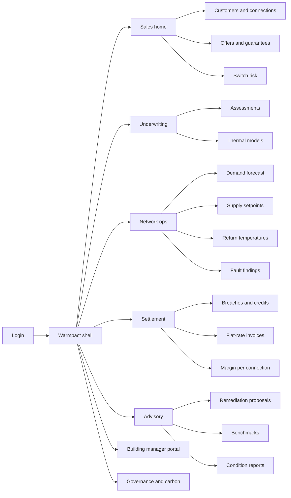
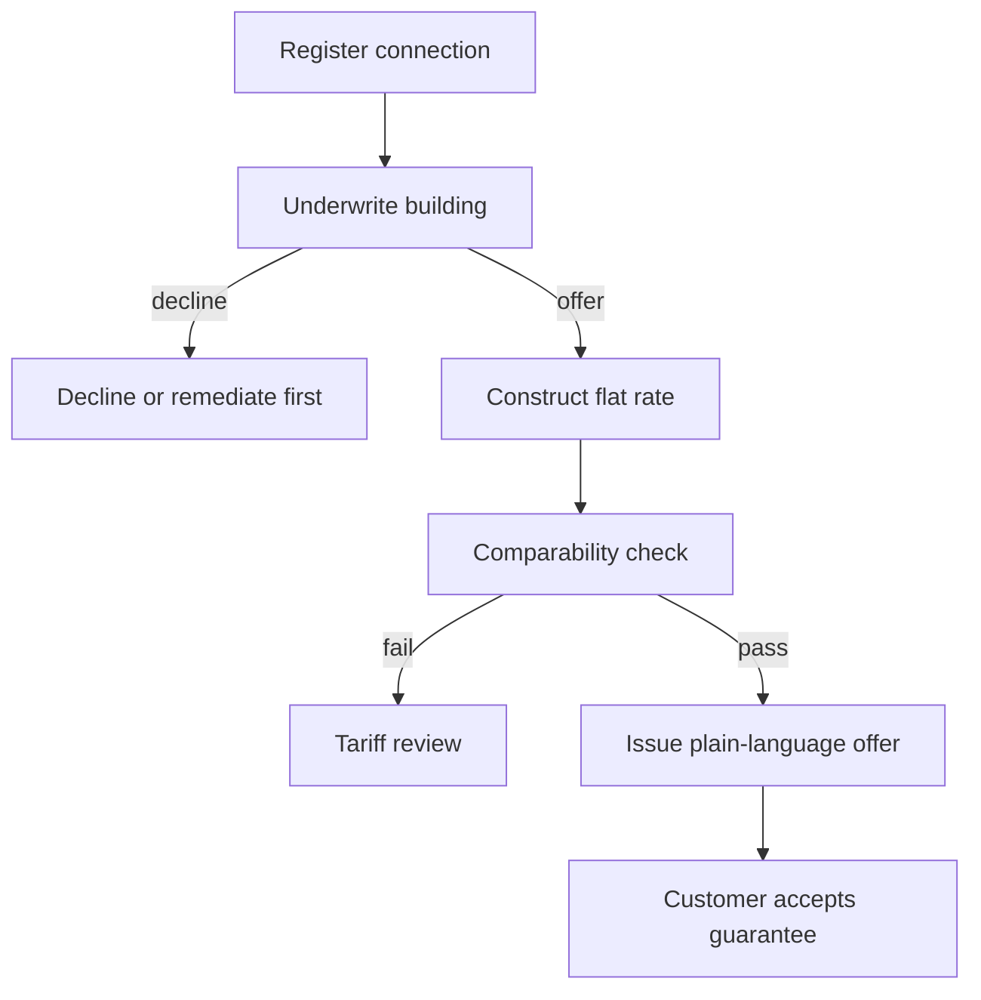
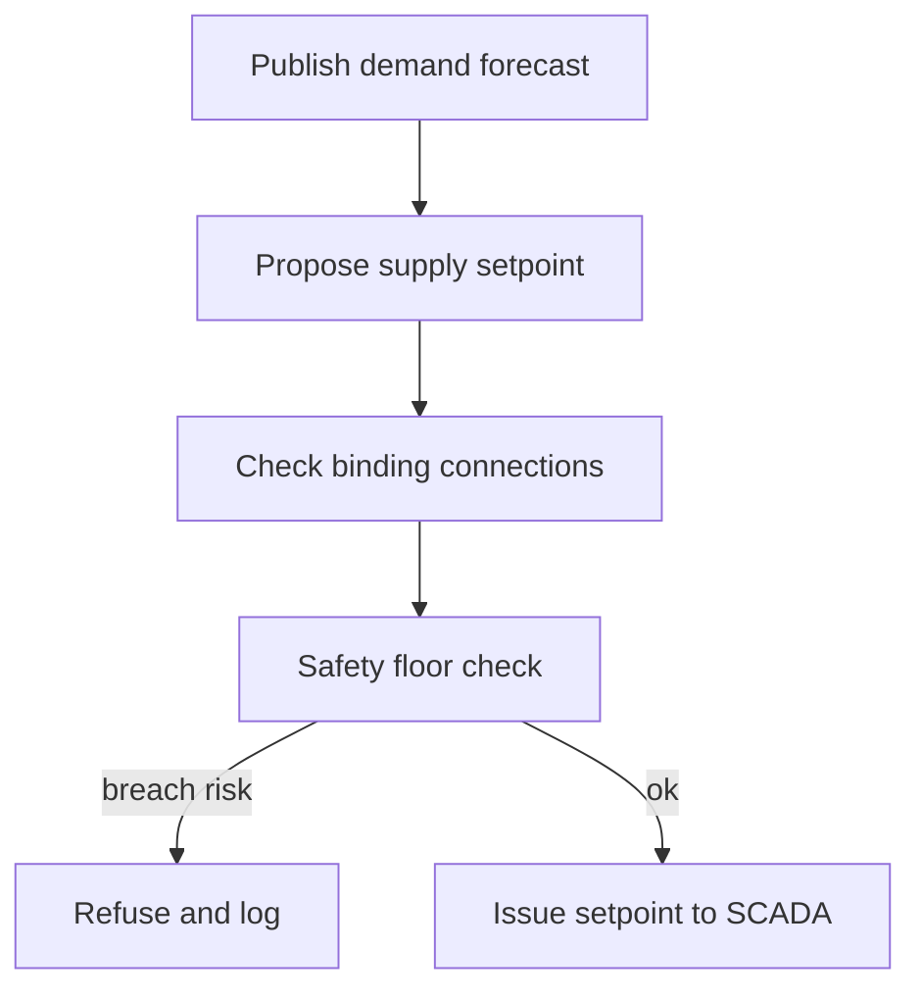

# Warmpact — Web app

**Product:** [PRODUCT.md](./PRODUCT.md)
**Primary surface:** Condition-as-a-service console (sales/underwriting + network ops + settlement under one Warmpact shell)
**Secondary surfaces:** Building-manager portal (conclusions and actions only); technician work-order field view; exit-package export viewer (read-only)
**Design thesis:** Warmpact is an underwriting and settlement desk for indoor condition — not a heat-meter dashboard. The UI metaphor is a guarantee ledger paired with a network thermostat: every commercial screen starts from “can we underwrite this building?” and every ops screen ends at “did the guarantee hold without crossing a safety floor?” Visual language is cool network slate with warm copper confirmation for in-band conditions and ember for return-temperature cost — heat as promise, not as a megawatt-hour chart. The Warmpact wordmark sits as a quiet copper seal on every margin- and guarantee-bearing view so the heating company always knows it is selling condition, not volume.

## UX research synthesis

### Category peers (best-in-class)

- **Danfoss Leanheat Network / Leanheat Building:** Weather-normalised demand control and supply-temperature optimisation with clear “binding connection” logic. Steal: network setpoint screens that show which connections constrain the next temperature drop; reject Leanheat’s building-automation density as the customer-facing default — Warmpact customers refuse raw data and manual adjustment (BR-6).
- **NODA Intelligent Systems / Utilifeed (district heating digitalisation):** Substation anomaly detection and return-temperature ranking for DH operators. Steal: fault findings as evidence-bearing work orders ranked by network cost; reject pure monitoring portals that never price a flat-rate guarantee.
- **Schneider EcoStruxure Building / Siemens Navigator:** Condition and comfort reporting for facility managers. Steal: plain-language status and recommended actions as the primary surface; reject KPI card walls and half-hourly consumption graphs as the product home.
- **Helen / Fortum district-heat customer portals (Nordic incumbents):** Tariff and connection self-service for housing companies. Steal: clear contract terms and service-level language housing managers already understand; reject metered-MWh as the hero metric when Warmpact’s value is margin decoupled from volume (BR-3).

### Patterns to adopt / reject

- **Adopt:** Underwriting-before-price as a hard gate; transparent flat-rate component breakdown; automatic service credits without customer-reported breach; anonymised cohort benchmarks with minimum size; return-temperature leaderboard by network cost; safety floors as non-dismissible chrome; exit/transfer package visible in every offer; margin-per-connection reported beside (not instead of) volume only when proving decoupling.
- **Reject:** Usage-monitoring portal as the flagship product (source thesis); provider-dictated opaque pricing; optimisation knobs that can lower DHW below legionella floors; identifiable peer consumption in benchmarks; “energy saving” proposals that hide long-run annual expenditure; lock-in without exit terms; purple AI insight panels; MWh-first sales home.

### Trust, density, and workflow constraints from PRODUCT.md

Flat-rate condition products must coexist with published heat tariffs and withstand non-discrimination scrutiny (BR-10): pricing UI must show named components and comparability checks. Guarantees create health/safety exposure (BR-5): minimum indoor and DHW temperatures are floors outside commercial control — override attempts are refused and logged, not approved. Customers want conclusions and partnership, not data work (BR-6, BR-7, BR-8). Building findings are commercially sensitive; benchmarks need anonymity thresholds. Sales must run on the existing heat-sales team: underwriting throughput and offer generation cannot require a weeks-long engineering queue. Return temperature is where volume-decoupled margin is earned (BR-11); carbon must sit in the cost model (BR-12).

## Information architecture

### Nav model

### Roles → default home

| Role | Default home | Why |
|------|--------------|-----|
| Heat sales / account manager | Sales home — offers and switch risk | Sell guarantees before capital decisions leave |
| Underwriting analyst | Underwriting assessments | Price follows risk (BR-2) |
| Network ops / load planner | Network ops — setpoints and return temps | Deliver guarantee profitably (BR-11) |
| Substation technician | Fault findings / work orders | Diagnose in the field with evidence |
| Energy advisor | Advisory — proposals and benchmarks | Be present in the customer’s energy project (BR-8) |
| Billing / revenue assurance | Settlement — invoices and margin | Decoupling proof (BR-3, BR-4) |
| Tariff / governance | Governance — comparability and events | Tariff coexistence (BR-10) |
| Building manager (external) | Building manager portal | Conclusions only (BR-6) |

### Cross-links to OpenAPI resources

| Nav area | OpenAPI tags / resources |
|----------|---------------------------|
| Customers, connections, substations | Customers |
| Assessments, thermal models | Underwriting |
| Condition products, guarantees, exit packages, safety floors | Guarantees |
| Flat rates, comparability | Pricing |
| Demand forecasts | Forecasting |
| Setpoints, return temperatures | NetworkOptimisation |
| Fault findings, work orders | Diagnostics |
| Measurements, breaches, invoices, margin | Settlement |
| Remediation, benchmarks, condition reports | Advisory |
| Carbon intensity, audit events | Governance |

## Screen inventory

### Sales home

- **Purpose:** Answer “where can we sell or renew a condition guarantee before the customer funds a heat pump?” in one composition.
- **Entry:** Default for account managers.
- **Layout regions:** Warmpact brand + portfolio strip (connections under condition contract, switch-risk count, margin trend decoupled from MWh); pipeline of underwriting-ready / offer-ready buildings; switch-risk rail (alternative-heating signals); alerts (revision triggers due, exits pending).
- **Primary actions:** Open connection; start underwriting; generate offer from completed assessment; open switch-risk account.
- **Empty / loading / error:** Empty = guided register first housing-company connection; loading = skeleton pipeline; error = retry with request id.
- **BR / story ties:** BR-1, BR-9; account manager stories.

### Customers and connections

- **Purpose:** Navigate heat customers and building connections with contract status (metered / underwriting / condition / exited).
- **Entry:** Sales nav; ops deep link from binding connection.
- **Layout regions:** Customer list by segment; connection table with substation id, return-temp health, guarantee status; detail drawer.
- **Primary actions:** Register connection; open underwriting; open guarantee; open portal preview.
- **Empty / loading / error:** Empty customer = add housing company / public property; integration error on metering = blocking banner.
- **BR / story ties:** Wedge segments; Customers API.

### Underwriting assessment

- **Purpose:** Decide offer, decline, or remediation-first from thermal model, substation health, and envelope — before any price is quoted.
- **Entry:** Sales CTA; underwriting queue.
- **Layout regions:** Assessment header (connection, status); thermal model summary; substation health; envelope condition; comparable portfolio outcomes; decision panel (offer / decline / remediate) with rationale; blocked pricing until decision = offer.
- **Primary actions:** Complete assessment; decline with reason; route to remediation; release to pricing.
- **Empty / loading / error:** Insufficient telemetry = cannot underwrite (hard stop); loading = model build progress.
- **BR / story ties:** BR-2; underwriting analyst stories.

### Offer and guarantee editor

- **Purpose:** Sell plain-language operating condition (indoor band, DHW availability, response time) at a transparently constructed flat rate with exit terms visible.
- **Entry:** From underwriting “offer”; sales pipeline.
- **Layout regions:** Guarantee template in plain language; exclusions; price components (fuel, carbon, risk, service) with revision triggers; annual expenditure effect vs metered status quo; exit/transfer package summary; comparability check status; safety-floor reference (read-only).
- **Primary actions:** Generate priced offer; submit for approval; send to customer; open exit terms detail.
- **Empty / loading / error:** No underwriting = editor locked; comparability fail = cannot issue until reviewed (BR-10).
- **BR / story ties:** BR-1, BR-9, BR-10, BR-12.

### Network ops home

- **Purpose:** Plan supply temperature and load against forecast demand without breaching guarantees or safety floors.
- **Entry:** Default for load planners.
- **Layout regions:** Network forecast vs production; current supply setpoint; binding connections list; safety-floor status; return-temp cost summary; fault backlog count.
- **Primary actions:** Open setpoint planner; open return-temp ranking; open forecast; open diagnostics.
- **Empty / loading / error:** SCADA link down = setpoint actions disabled with banner.
- **BR / story ties:** BR-5, BR-11; load planner stories.

### Demand forecast

- **Purpose:** Building- and network-level heat demand against weather and occupancy for dispatch and procurement.
- **Entry:** Ops nav → Forecast.
- **Layout regions:** Horizon selector; network aggregate chart; building drill table; weather/degree-day context; forecast vs guarantee load note.
- **Primary actions:** Publish forecast; export for fuel procurement; pin binding buildings.
- **Empty / loading / error:** Missing weather feed = degraded banner with last good run.
- **BR / story ties:** Forecasting capability; load planner stories.

### Supply setpoint planner

- **Purpose:** Lower supply temperature where connected buildings allow; show which connections constrain the next step; hard-stop at safety floors.
- **Entry:** Ops home; forecast.
- **Layout regions:** Proposed setpoint; constraint list (guarantee-binding connections); safety-floor rail (indoor min, DHW legionella min) with refused-override log link; impact preview on distribution loss.
- **Primary actions:** Issue setpoint to SCADA; simulate step-down; open binding connection.
- **Empty / loading / error:** Override attempt UI = refuse + log (no approve path); SCADA reject = error with runbook.
- **BR / story ties:** BR-5, BR-11.

### Return temperature ranking

- **Purpose:** Rank connections by cost to the network so ops fix what matters, not who complains.
- **Entry:** Ops nav.
- **Layout regions:** Ranked table (return temp, cost impact, contract status); trend spark for top offenders; link to diagnostics/work order.
- **Primary actions:** Create fault finding; open connection; export improvement cohort.
- **Empty / loading / error:** Empty = all connections within target (celebrate briefly, then show network average).
- **BR / story ties:** BR-11.

### Fault findings and work orders

- **Purpose:** Continuous diagnostics (high return, fouled/undersized HEX, valve fault, bypass) as evidence-bearing work orders.
- **Entry:** Technician default; ops diagnostics.
- **Layout regions:** Finding queue with suspected cause; evidence pane (telemetry snippets); work-order status; field notes.
- **Primary actions:** Dispatch work order; close with cause; escalate to advisory if building-side.
- **Empty / loading / error:** Empty = no open findings; incomplete evidence = cannot dispatch.
- **BR / story ties:** Diagnostics capability; technician stories.

### Settlement home — breaches and credits

- **Purpose:** Settle guarantee performance from measured conditions; credit automatically without customer detection.
- **Entry:** Billing default; period close.
- **Layout regions:** Period selector; breach list (auto-detected); credit amounts; measurement coverage; exceptions above threshold queue.
- **Primary actions:** Approve exception; generate invoices; open measurement detail.
- **Empty / loading / error:** Empty breaches = “guarantees held”; measurement gap = coral coverage warning.
- **BR / story ties:** BR-4.

### Flat-rate invoices and margin report

- **Purpose:** Issue flat-rate invoices with credits; prove gross margin per connection independent of delivered MWh.
- **Entry:** Settlement nav.
- **Layout regions:** Invoice list; credit line items; margin-per-connection chart with MWh correlation (should weaken); carbon intensity line on cost model.
- **Primary actions:** Issue period invoices; export board pack; open comparability evidence.
- **Empty / loading / error:** No condition contracts = empty state pointing to sales.
- **BR / story ties:** BR-3, BR-4, BR-12.

### Remediation proposals and benchmarks

- **Purpose:** Issue retrofit/remediation stating long-run annual expenditure effect, vs anonymised comparable cohort — even when volume falls.
- **Entry:** Advisory default; underwriting “remediate first.”
- **Layout regions:** Proposal editor (actions, expenditure effect, volume impact disclosure); benchmark panel (cohort size, anonymity threshold met/fail); approval and send.
- **Primary actions:** Create proposal; check cohort; approve; send to building manager.
- **Empty / loading / error:** Cohort below minimum size = block identifiable compare; show “insufficient peers.”
- **BR / story ties:** BR-7, BR-8; energy advisor stories.

### Plain-language condition report (portal)

- **Purpose:** Building-manager home: conclusions, condition status, recommended actions — never raw consumption or manual optimisation tasks.
- **Entry:** External portal login; sales “preview as customer.”
- **Layout regions:** Condition status (in band / credit applied); conclusions list; open proposals; guarantee terms and exit summary; carbon disclosure.
- **Primary actions:** Accept/decline proposal; download exit package when eligible; contact account manager.
- **Empty / loading / error:** No active guarantee = metered-tariff message with path to offer; never show empty chart void.
- **BR / story ties:** BR-6, BR-9, BR-12; customer interview thesis.

### Governance — carbon, comparability, audit

- **Purpose:** Tariff coexistence evidence, carbon intensity in cost model, and immutable log of guarantee/price/override attempts.
- **Entry:** Tariff officer / governance admin.
- **Layout regions:** Comparability checks; carbon intensity publish; governance event timeline (including refused safety overrides).
- **Primary actions:** Run comparability review; publish carbon; export audit slice.
- **Empty / loading / error:** Failed comparability = block new offers in that segment.
- **BR / story ties:** BR-5, BR-10, BR-12.

### Exit package

- **Purpose:** On exit/transfer, return building model, condition history, and settings — portability as a feature.
- **Entry:** Guarantee detail; portal when terminated.
- **Layout regions:** Package contents checklist; release attestation; download.
- **Primary actions:** Release package; confirm customer receipt.
- **Empty / loading / error:** Active contract = package not releasable; error = incomplete model warning.
- **BR / story ties:** BR-9.

## Key flows

1. **Sell condition contract** — register connection → underwrite → offer/decline/remediate → transparent flat-rate price → comparability pass → customer accepts; failure: cannot underwrite or comparability fails.

2. **Operate inside floors** — forecast → propose lower supply temp → check binding connections + safety floors → issue setpoint or refuse; override attempts logged and refused.

3. **Guarantee settlement** — measure conditions → detect breach without customer report → apply service credit → invoice flat rate (BR-4).

4. **Fix costly return temperature** — rank by network cost → raise fault finding → dispatch work order → close with evidence → margin impact tracked (BR-11).

5. **Advisory without absence** — building constrains guarantee → remediation proposal with long-run expenditure + anonymised benchmark → send even if heat volume falls (BR-8).

## Design system

### Tokens (CSS variables)

- `--color-ink: #E8EEF0` — primary text on dark ground
- `--color-network-950: #0B1014` — app ground
- `--color-network-900: #141B22` — panels
- `--color-network-700: #2C3A46` — rules/dividers
- `--color-copper: #C48A5A` — in-band condition / settled credit confirmation
- `--color-copper-dim: #7A5234` — copper on dark
- `--color-ember: #D97757` — return-temp cost / breach attention (warm, not alarm-red alone)
- `--color-coral: #E85D4C` — safety-floor block / measurement gap
- `--color-steel: #8A9AA8` — secondary labels
- `--color-brand: #D4B08C` — Warmpact wordmark accent (quiet copper)
- `--font-display: "Fraunces", Georgia, serif` — guarantee headlines and condition status
- `--font-body: "Satoshi", "IBM Plex Sans", sans-serif` — console density
- `--font-mono: "IBM Plex Mono", monospace` — connection ids, setpoints °C, invoice lines
- `--space-1`…`--space-8`: 4px scale
- `--radius-sm: 4px`; `--radius-md: 8px` — industrial utility, not pill-heavy
- `--motion-band: 180ms ease-out` — condition in-band confirm
- `--motion-floor: 200ms ease-in-out` — safety-floor refuse flash
- `--motion-credit: 220ms ease-out` — service credit apply
- Atmosphere: soft radial warmth at top of ops views (heat in the pipes), cool slate elsewhere; subtle isometric network-line texture — not stock radiator photography in console; portal may use municipal heating-company brand with Warmpact as quiet processor mark.

### Typography & brand

- Fraunces for guarantee statements and portal conclusions; Satoshi/Plex for ops tables; mono for temperatures, ids, price components.
- Brand wordmark left of shell on every guarantee- and margin-bearing view; never replaced by “Dashboard” as the strongest mark.
- Login shell: brand as hero-level signal; one headline (“Sell the condition — underwrite the building”); one CTA — no MWh stat strips.

### Do / don’t

- **Do:** Gate price behind underwriting; show price components and exit terms; auto-credit breaches; rank return temp by cost; refuse safety overrides in UI; speak conclusions to building managers.
- **Don’t:** Purple AI glow; monitoring charts as the product; opaque bilateral prices; customer-reported-only breach workflows; identifiable peer data; card grids for static KPIs; emoji status; rounded-full filter pills everywhere.

### Accessibility & domain trust cues

- Contrast AA+ on copper/ember/coral against network slate; pair colour with text (In band / Breached / Floor held).
- Live regions announce setpoint issues, breach credits, and refused overrides.
- Focus order follows commercial path: underwriting → offer → settlement → exit.
- Portal never requires interpreting raw series to know if the guarantee held.

## Component patterns

- **UnderwritingGate** — blocks pricing until offer/decline/remediate decision.
- **GuaranteePlainLanguage** — indoor band, DHW, response time, exclusions without metering jargon.
- **PriceComponentStack** — named flat-rate components including fuel and carbon.
- **SafetyFloorRail** — non-negotiable mins; override attempt → refuse + GovernanceEvent.
- **BindingConnectionList** — connections that constrain the next supply-temp step-down.
- **ReturnTempCostRank** — connection ranking by network cost impact.
- **FaultEvidenceOrder** — finding + telemetry evidence + work order.
- **AutoCreditLine** — breach → service credit without customer claim.
- **MarginDecoupleChart** — margin per connection vs MWh correlation.
- **AnonBenchmarkPanel** — cohort compare with minimum-size enforcement.
- **ExitPackageRelease** — model + history + settings on transfer.
- **ConclusionReport** — portal conclusions and actions only.

## Out of scope for v1 web

- Full SCADA HMI replacement; production-plant DCS screens; consumer dwelling apps for tenants (building manager is the external user); heat-pump sales configurators for competitors; municipal GIS master planning; native offline field-only apps beyond work-order view; white-label multi-utility marketplace.
